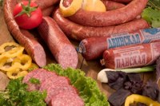

Расположенное в г.Береза Бресткой области предприятие ОАО "Березовский мясоконсервный комбинат" является лидером мясоперерабатывающей отрасли Республики Беларусь.

Комбинат производит и реализует:

* Мясо и субпродукты (переработка говядины, свинины, баранины, конины)
* Колбасные изделия более 250 наименований, в том числе колбасы вареные, сосиски, сардельки, колбасы варено-копченые, полукопченые, сырокопченые, сыровяленные, колбасы из субпродуктов и крови, продукты из свинины и говядины (копчености)
* Консервы мясные – более 40 наименований, в том числе ветчинные пастеризованные
* Полуфабрикаты из свинины и говядины, в том числе фарши, котлеты, пельмени, вареники
* Жиры пищевые топленые
* Жиры кормовые и технические
* Сухие животные корма
* Альбумин пищевой
* Кишечное сырье консервированное
* Шкуры консервированные
* Хлебобулочные изделия

Предприятие оказывает услуги:

* По переработке давальческого сырья
* Изготовлению продукции из давальческого сырья
* Изготовлению жестетары
* Литографированию жести

Комбинат принимает активное участие в выставках, ярмарках продовольственных товаров в Республике Беларусь, Российской Федерации, Республике Польша. Награжден многочисленными грамотами, дипломами и медалями за качество продукции.

Клиентами ОАО "Березовский МКК" являются отечественные и зарубежные партнеры как по поставкам сырья, так и по реализации готовой продукции. Ассортимент изготавливаемой продукции на предприятии составляет более 300 наименований. ОАО "Березовский МКК" единственный в станах СНГ производит ветчинные пастеризованные консервы. Наряду с выработкой традиционных видов продукции на комбинате освоен выпуск более 150 наименований новых видов продукции, применяются новые типы оболочек, упаковок, что позволяет выпускать высококачественную продукцию с удлиненными сроками хранения. Постоянное обновление ассортимента выпускаемой продукции позволяет удовлетворять потребности и вкус любого покупателя.

ОАО "Березовский МКК" включен в план реконструкции мясной промышленности Республики Беларусь, производится модернизация и замена устаревшего оборудования, что позволяет выпускать высококачественную продукцию.

Главный девиз работников предприятия: **"Качество продукции сегодня – наше благополучие завтра"**

# История

Строительство комбината началось в ноябре 1972 года по проекту Минского филиала «Ленгипромясомолпроект» и велось в несколько этапов. Приказ № 9-орг. От 16 марта 1978 года, подписанный министром мясной и молочной промышленности СССР С.Ф. Литвиновым, гласил: "Ввести в эксплуатацию мясокомбинат в г. Береза Брестской области Белорусской ССР мощностью 120 тонн мяса, 15 тонн колбасных изделий в смену с холодильником емкостью 4.4 тысячи тонн единовременного хранения".

## Основные этапы строительства комбината

* 1975 год - холодильник емкостью 4000 тонн единовременного хранения мяса
* 1976 год - мясожировой цех мощностью 120 тонн мяса КРС в смену и вторая очередь холодильника емкостью 400 тонн единовременного хранения мяса
* 1977 год - мясоперерабатывающий цех с выпуском колбасных изделий 15 тонн в смену, полуфабрикатов и фасованной продукции 15-20 тонн (45 тонн переработанного мяса в смену)
* 1978 год – консервный завод мощностью 100 тысяч условных банок (туб) в смену, из них 20 туб в смену ветчинных пастеризованных консервов, с холодильником емкостью 500 тонн единовременного хранения и цех литографии
* 2002 год – участок по выпечке хлебобулочных изделий мощностью 350 кг изделий в смену

Площадь территории комбината составляет 20.2 га.

В состав предприятия входят:

* основной комплекс по переработке скота, выпуска и хранения готовой продукции, состоящий из:
  * мясожирового цеха,
  * колбасно-кулинарного цеха,
  * холодильника,
  * консервного цеха,
  * литографии,
  * хлебного участка,
* а также объекты вспомогательного назначения и инженерного обеспечения:
  * компрессорный цех,
  * котельная,
  * ремонтно-механический участок,
  * ремонтно-строительный участок,
  * электроучасток,
  * участок КИПиА,
  * участок отопления и вентиляции,
  * участок водоснабжения и канализации,
  * тарный участок.
  * автотранспортный участок.

За историю развития комбината уделялось огромное внимание социально-культурному развитию. Были построены столовая, здравпункт, теплица, два общежития, оздоровительный лагерь/база отдыха "Березка, 11 жилых многоквартирных домов. Создана сеть фирменных магазинов, в т.ч. 3 магазина и 3 павильона в г.Березе, магазины и торговые павильоны в гг.Бресте, Пружаны, Ивацевичи, Коссово, д.Новые Засимовичи Пружанского района, гг.Белоозерске, Дрогичине, магазин в г.Кобрине.

Кроме того, комбинатом проведена реконструкция бывшего поста ГАИ, расположенного по трассе Брест-Минск, и сейчас там находится уютное мини-кафе, где очень большой ассортимент обеденных блюд, закусок, а также колбасных изделий и копченостей, нарезанных сервировочно, и упакованных на упаковочной линии "Мультивак" под вакуумом и в среде модифицированной газовой среды.

В мае 2001 года Березовский мясоконсервный комбинат был преобразован в коммунальное производственное унитарное предприятие "Березовский мясоконсервный комбинат". А в соответствии с приказом №379 от 29.12.03г. предприятие преобразовано в открытое акционерное общество "Березовский мясоконсервный комбинат".

За время своей работы комбинат утвердился на рынке республики и за ее пределами в списке общепризнанных лидеров по производству мясных консервов и колбасных изделий, по разработке новых видов продукции и внедрению прогрессивных технологий, применению современных оболочек и упаковочных материалов.
